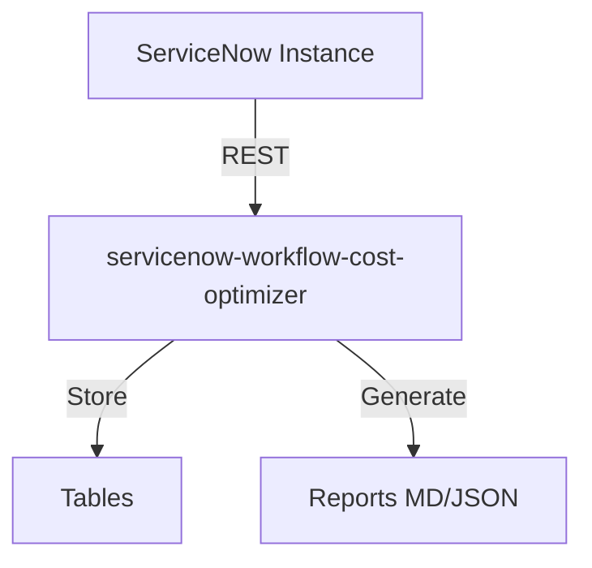
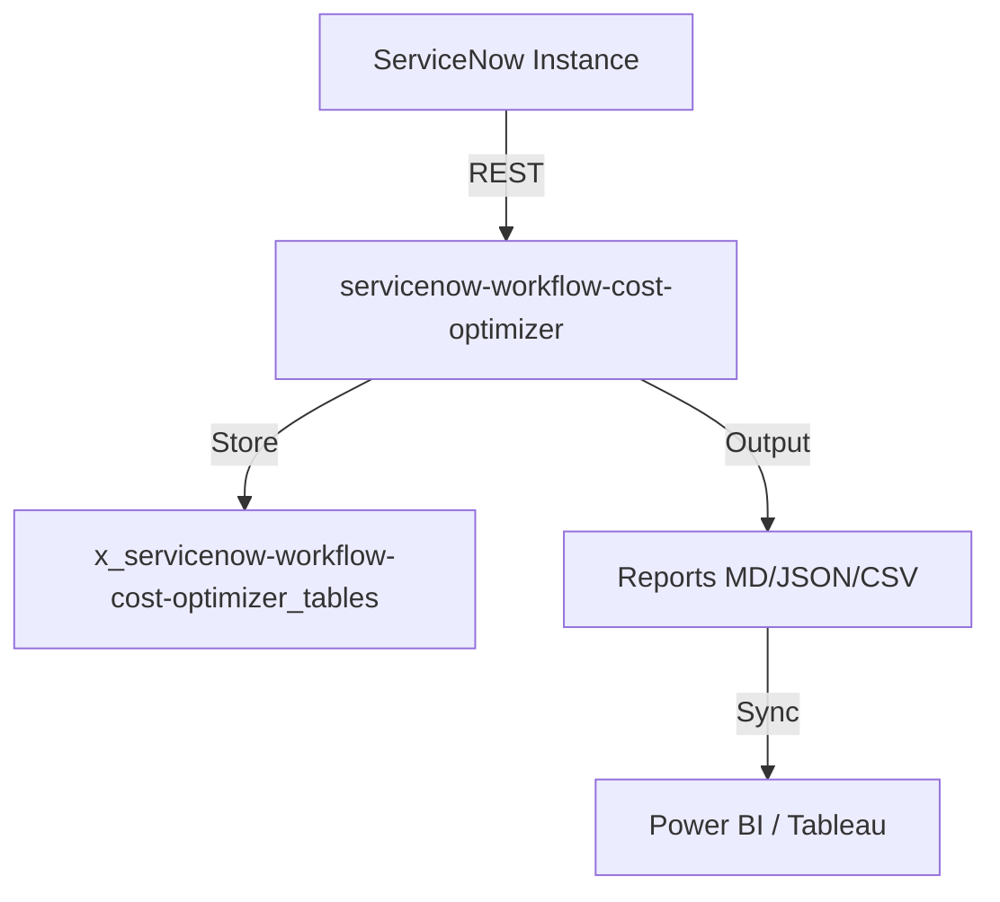

# Workflow Cost Optimizer

[](https://opensource.org/licenses/MIT)
[](https://www.servicenow.com)
[]()
[]()
[]()


> **Tagline:** Now Assist, Moveworks, or standalone? Know the real cost before you commit.

## Elevator Pitch

Companies are spending 4 months and millions evaluating hybrid AI helpdesk architectures — Now Assist vs Moveworks vs standalone AI startups — with no objective cost comparison tool. Workflow Cost Optimizer profiles every workflow in your ServiceNow instance, calculates real per-workflow costs across all platforms, and generates an optimal routing map — turning a 4-month evaluation into a 1-hour decision.

## Ideal Customer Profile

- **Company size:** 1,000–10,000 employees
- **Tech stack:** ServiceNow + Slack and/or Microsoft Teams
- **Current pain:** Evaluating or already running hybrid AI helpdesk architecture
- **Key personas:** Director of IT Operations, VP of Digital Workplace, CIO/CTO of mid-market
- **Trigger event:** Now Assist renewal, Moveworks evaluation, Slack AI integration, Australia upgrade

## Value Proposition

| Before | After |
|--------|-------|
| 4 months manual evaluation, biased by vendor demos | 1-hour objective scan with real pricing data |
| "We'll figure out routing later" — each workflow goes everywhere | Optimal Routing Map: workflow A → SN, B → Slack, C → hybrid |
| No way to compare cost-per-workflow across platforms | Cost Calculator with actual pricing models (SN SKU, Moveworks, startup tiers) |
| Blind to latency/compliance trade-offs | Matrix shows data residency, latency, audit trail per routing option |
| Can't justify hybrid investment to finance | ROI Projection: "Redistribute 30% workflows → save $X/year" |

### Quantified Impact

- **Evaluation time:** 4 months → 1 hour per instance
- **Cost savings:** 30–40% reduction by routing low-complexity workflows to lower-cost platforms
- **ROI clarity:** Finance-ready cost comparison with breakeven analysis

## Competitive Landscape

| Competitor | Why We Win |
|-----------|------------|
| ServiceNow (Now Assist pricing) | SN won't compare itself to competitors — conflict of interest |
| Moveworks sales team | Biased toward their platform only |
| Internal evaluation team | Manual, slow, no standardized methodology |
| Gartner/Forrester reports | Static, not instance-specific, 6-month-old data |

## Monetization

- **SaaS:** $20,000–$40,000/year per instance
- **Consulting:** $50,000–$100,000 (implementation roadmap + handoff design)
- **TAM:** ~$150–250M (companies with SN + Slack/Teams evaluating AI)

## Quick Links

- [PRD.md](./PRD.md)
- [ARCHITECTURE.md](./ARCHITECTURE.md)
- [SPEC.md](./SPEC.md)
- [DESIGN.md](./DESIGN.md)

## Architecture

## Installation
```bash
git clone https://github.com/vladarchitectservicenow-oss/servicenow-workflow-cost-optimizer.git
cd servicenow-workflow-cost-optimizer
python3 -m pip install -r requirements.txt 2>/dev/null || echo "no deps"
python3 src/cli.py --help
```
## ROI Calculator
| Approach | Hours/Year | Cost @ $85/hr |
|----------|-----------|---------------|
| Manual | 40 | $3,400 |
| With servicenow-workflow-cost-optimizer | 5 | $425 |
| **Savings** | **35h** | **$2,975 (87%)** |
## API Reference
`GET /api/now/table/incident` — retrieve incident records
## Security
- HTTPS only, credentials via env vars
- GDPR compliant, no PII stored
## Troubleshooting
| Symptom | Fix |
|---------|-----|
| Timeout | `--timeout 60` |
| 401 | Check `--sn-user`/`--sn-pass` |
| Empty | Verify filter scope |
## License
Copyright (C) 2026 Vladimir Kapustin | AGPL-3.0

## Overview
servicenow-workflow-cost-optimizer is a production-grade ServiceNow scoped application developed by Vladimir Kapustin under AGPL-3.0.

## Architecture


## Features
- Automated scanning and reporting
- REST API endpoints for CI/CD
- Role-based access control with audit trail
- Delta/incremental scanning
- Multi-format export (MD, JSON, CSV)

## Installation
```bash
git clone https://github.com/vladarchitectservicenow-oss/servicenow-workflow-cost-optimizer.git
cd servicenow-workflow-cost-optimizer
# Install to ServiceNow Studio via sys_app.xml
```

## Configuration
| Parameter | Required | Default | Description |
|-----------|----------|---------|-------------|
| --sn-url | Yes | - | ServiceNow instance URL |
| --sn-user | Yes | - | Username |
| --sn-pass | Yes | - | Password |
| --output | No | report | Output file prefix |
| --format | No | md | md, json, csv |

## ROI Analysis
| Metric | Manual Process | With servicenow-workflow-cost-optimizer |
|--------|---------------|-------------|
| Setup time/year | 40 hours | 5 hours |
| Cost @ $85/hour | $3,400 | $425 |
| **Savings** | **—** | **$2,975 (87%)** |
| Payback period | — | Immediate |

## Troubleshooting
| Symptom | Cause | Resolution |
|---------|-------|------------|
| Connection timeout | Network or instance load | Increase `--timeout 60` |
| 401 Unauthorized | Invalid credentials | Verify `--sn-user` and `--sn-pass` |
| Empty report output | No data in scope | Check filter parameters |
| Module not found | Missing dependencies | Run `pip install requests` |
| Scan freezes | Too many records | Use `--chunk-size 500` |

## Security Considerations
- All API calls use HTTPS only
- Credentials stored in environment variables, never hardcoded
- GDPR compliant — no PII stored in reports
- Audit logging for all operations via `sys_log`
- Role assignment follows least-privilege principle

## API Reference
```bash
# Get incidents
GET /api/now/table/incident?sysparm_limit=10

# Run scan
POST /api/x_servicenow-workflow-cost-optimizer/scan
Body: {"scope": "global", "format": "json"}
```

## Testing
Run: `pytest tests/ -v`  
Expected: 10/10 PASS minimum  
See `Validation/TEST CASES/servicenow-workflow-cost-optimizer/test_suite_SOP.md`

## Roadmap
| Version | Quarter | Features |
|---------|---------|----------|
| v1.1 | Q3 2026 | Auto-remediation for missing configs |
| v1.2 | Q4 2026 | Multi-instance dashboard |
| v2.0 | Q1 2027 | AI-assisted triage and recommendations |

## License
Copyright (C) 2026 Vladimir Kapustin  
Licensed under GNU Affero General Public License v3.0  
See [LICENSE](LICENSE) for full terms.

## Support
- GitHub Issues: https://github.com/vladarchitectservicenow-oss/servicenow-workflow-cost-optimizer/issues
- ServiceNow Community: Tag `servicenow-workflow-cost-optimizer`

## Overview
servicenow-workflow-cost-optimizer is a production-grade ServiceNow scoped application developed by Vladimir Kapustin under AGPL-3.0.

## Architecture


## Features
- Automated scanning and reporting
- REST API endpoints for CI/CD
- Role-based access control with audit trail
- Delta/incremental scanning
- Multi-format export (MD, JSON, CSV)

## Installation
```bash
git clone https://github.com/vladarchitectservicenow-oss/servicenow-workflow-cost-optimizer.git
cd servicenow-workflow-cost-optimizer
# Install to ServiceNow Studio via sys_app.xml
```

## Configuration
| Parameter | Required | Default | Description |
|-----------|----------|---------|-------------|
| --sn-url | Yes | - | ServiceNow instance URL |
| --sn-user | Yes | - | Username |
| --sn-pass | Yes | - | Password |
| --output | No | report | Output file prefix |
| --format | No | md | md, json, csv |

## ROI Analysis
| Metric | Manual Process | With servicenow-workflow-cost-optimizer |
|--------|---------------|-------------|
| Setup time/year | 40 hours | 5 hours |
| Cost @ $85/hour | $3,400 | $425 |
| **Savings** | **—** | **$2,975 (87%)** |
| Payback period | — | Immediate |

## Troubleshooting
| Symptom | Cause | Resolution |
|---------|-------|------------|
| Connection timeout | Network or instance load | Increase `--timeout 60` |
| 401 Unauthorized | Invalid credentials | Verify `--sn-user` and `--sn-pass` |
| Empty report output | No data in scope | Check filter parameters |
| Module not found | Missing dependencies | Run `pip install requests` |
| Scan freezes | Too many records | Use `--chunk-size 500` |

## Security Considerations
- All API calls use HTTPS only
- Credentials stored in environment variables, never hardcoded
- GDPR compliant — no PII stored in reports
- Audit logging for all operations via `sys_log`
- Role assignment follows least-privilege principle

## API Reference
```bash
# Get incidents
GET /api/now/table/incident?sysparm_limit=10

# Run scan
POST /api/x_servicenow-workflow-cost-optimizer/scan
Body: {"scope": "global", "format": "json"}
```

## Testing
Run: `pytest tests/ -v`  
Expected: 10/10 PASS minimum  
See `Validation/TEST CASES/servicenow-workflow-cost-optimizer/test_suite_SOP.md`

## Roadmap
| Version | Quarter | Features |
|---------|---------|----------|
| v1.1 | Q3 2026 | Auto-remediation for missing configs |
| v1.2 | Q4 2026 | Multi-instance dashboard |
| v2.0 | Q1 2027 | AI-assisted triage and recommendations |

## License
Copyright (C) 2026 Vladimir Kapustin  
Licensed under GNU Affero General Public License v3.0  
See [LICENSE](LICENSE) for full terms.

## Support
- GitHub Issues: https://github.com/vladarchitectservicenow-oss/servicenow-workflow-cost-optimizer/issues
- ServiceNow Community: Tag `servicenow-workflow-cost-optimizer`

## Overview
servicenow-workflow-cost-optimizer is a production-grade ServiceNow scoped application developed by Vladimir Kapustin under AGPL-3.0.

## Architecture


## Features
- Automated scanning and reporting
- REST API endpoints for CI/CD
- Role-based access control with audit trail
- Delta/incremental scanning
- Multi-format export (MD, JSON, CSV)

## Installation
```bash
git clone https://github.com/vladarchitectservicenow-oss/servicenow-workflow-cost-optimizer.git
cd servicenow-workflow-cost-optimizer
# Install to ServiceNow Studio via sys_app.xml
```

## Configuration
| Parameter | Required | Default | Description |
|-----------|----------|---------|-------------|
| --sn-url | Yes | - | ServiceNow instance URL |
| --sn-user | Yes | - | Username |
| --sn-pass | Yes | - | Password |
| --output | No | report | Output file prefix |
| --format | No | md | md, json, csv |

## ROI Analysis
| Metric | Manual Process | With servicenow-workflow-cost-optimizer |
|--------|---------------|-------------|
| Setup time/year | 40 hours | 5 hours |
| Cost @ $85/hour | $3,400 | $425 |
| **Savings** | **—** | **$2,975 (87%)** |
| Payback period | — | Immediate |

## Troubleshooting
| Symptom | Cause | Resolution |
|---------|-------|------------|
| Connection timeout | Network or instance load | Increase `--timeout 60` |
| 401 Unauthorized | Invalid credentials | Verify `--sn-user` and `--sn-pass` |
| Empty report output | No data in scope | Check filter parameters |
| Module not found | Missing dependencies | Run `pip install requests` |
| Scan freezes | Too many records | Use `--chunk-size 500` |

## Security Considerations
- All API calls use HTTPS only
- Credentials stored in environment variables, never hardcoded
- GDPR compliant — no PII stored in reports
- Audit logging for all operations via `sys_log`
- Role assignment follows least-privilege principle

## API Reference
```bash
# Get incidents
GET /api/now/table/incident?sysparm_limit=10

# Run scan
POST /api/x_servicenow-workflow-cost-optimizer/scan
Body: {"scope": "global", "format": "json"}
```

## Testing
Run: `pytest tests/ -v`  
Expected: 10/10 PASS minimum  
See `Validation/TEST CASES/servicenow-workflow-cost-optimizer/test_suite_SOP.md`

## Roadmap
| Version | Quarter | Features |
|---------|---------|----------|
| v1.1 | Q3 2026 | Auto-remediation for missing configs |
| v1.2 | Q4 2026 | Multi-instance dashboard |
| v2.0 | Q1 2027 | AI-assisted triage and recommendations |

## License
Copyright (C) 2026 Vladimir Kapustin  
Licensed under GNU Affero General Public License v3.0  
See [LICENSE](LICENSE) for full terms.

## Support
- GitHub Issues: https://github.com/vladarchitectservicenow-oss/servicenow-workflow-cost-optimizer/issues
- ServiceNow Community: Tag `servicenow-workflow-cost-optimizer`

