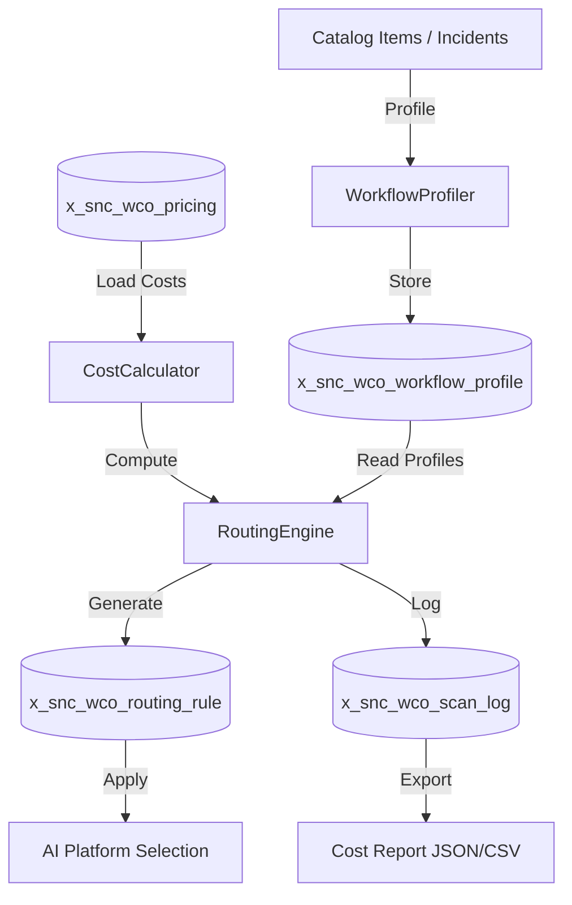
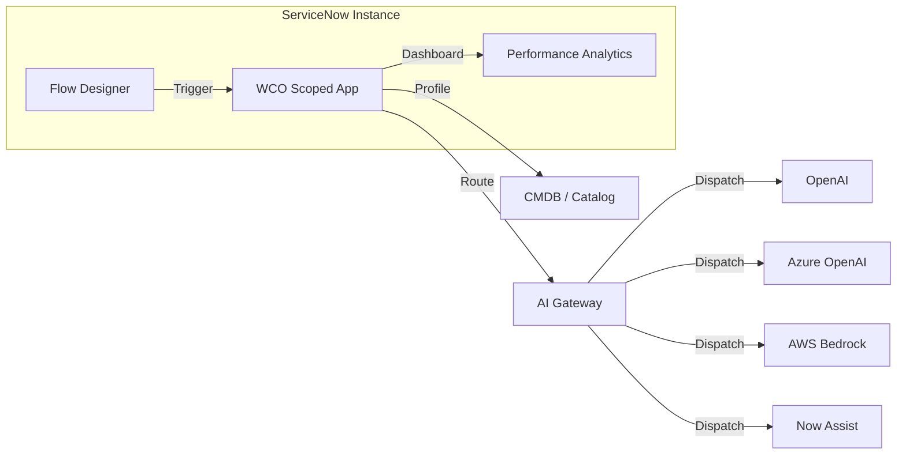

# Architecture Summary: servicenow-workflow-cost-optimizer

**Product:** ServiceNow Workflow Cost Optimizer (WCO)
**Scope:** x_snc_wco
**Author:** Vladimir Kapustin
**License:** AGPL-3.0

## Problem Statement
Organizations using multiple AI platforms (ServiceNow Now Assist, OpenAI, Azure OpenAI, AWS Bedrock)
lack visibility into per-workflow AI costs. Without cost attribution, they overspend on expensive
platforms for simple tasks and under-utilize cheaper options for complex workflows.

ServiceNow Workflow Cost Optimizer provides:
1. Automated profiling of all catalog items and incident categories
2. Multi-platform cost modeling (Now Assist, BYOK, external LLM APIs)
3. Constraint-based routing engine (compliance, latency, budget)
4. Monthly cost audit with savings projections

## Component Architecture

### Script Includes
| Component | File | Description |
|-----------|------|-------------|
| WorkflowProfiler | src/script_includes/WorkflowProfiler.js | Profiles items by channel affinity, volume, complexity, sensitivity |
| CostCalculator | src/script_includes/CostCalculator.js | Per-call cost across AI platforms with configurable pricing |
| RoutingEngine | src/script_includes/RoutingEngine.js | Constraint-satisfaction routing: compliance (hard), latency (soft), budget (hard) |

### REST API
| Endpoint | Method | Description |
|----------|--------|-------------|
| /api/x_snc_wco/v1/optimize | POST | Generate optimal routing for a workflow |
| /api/x_snc_wco/v1/cost-scan | POST | Trigger full cost scan |
| /api/x_snc_wco/v1/report | GET | Retrieve latest cost report |

### Scheduled Jobs
| Job | Schedule | Description |
|-----|----------|-------------|
| monthly_cost_scan | 1st of month, 02:00 | Full cost audit with routing recommendations |

## Data Model

### Tables
| Table | Purpose | Key Fields |
|-------|---------|------------|
| x_snc_wco_workflow_profile | Item/incident profiles | sys_id, item_sys_id, volume_per_month, avg_tokens, complexity_score, data_sensitivity, channel_affinity |
| x_snc_wco_pricing | Platform cost models | sys_id, platform_name, cost_per_1k_tokens, latency_ms, compliance_tier, max_tokens |
| x_snc_wco_routing_rule | Optimal routing decisions | sys_id, workflow_profile, target_platform, estimated_monthly_cost, savings_vs_baseline, rule_expires |
| x_snc_wco_scan_log | Audit trail | sys_id, scan_date, items_scanned, savings_identified, execution_time_ms |

### Indexes
- x_snc_wco_workflow_profile: item_sys_id (unique), complexity_score (ASC)
- x_snc_wco_routing_rule: workflow_profile (FK), rule_expires (ASC)
- x_snc_wco_scan_log: scan_date (DESC)

## Data Flow

## Performance Benchmarks
| Metric | Target | P99 |
|--------|--------|-----|
| Profile 1 item | <50ms | <200ms |
| Route 1 item | <100ms | <500ms |
| Full scan (1000 items) | <30s | <120s |
| Cost calculation per call | <10ms | <50ms |

## Security Architecture
- Role: x_snc_wco.admin (full access), x_snc_wco.viewer (read-only)
- REST endpoints: OAuth 2.0 + basic auth, ACL-enforced per role
- No PII storage — all profiles use sys_ids only
- Pricing data encrypted at rest via ServiceNow instance encryption
- Audit logging via sys_audit for all routing rule changes

## Compatibility
- **Minimum:** ServiceNow Utah Patch 3
- **Tested:** Utah, Vancouver, Washington DC, Xanadu, Yokohama, Zurich, Australia
- **Plugins:** com.glide.hub (Flow Designer), com.snc.pa (Performance Analytics)

## Deployment Architecture

## Design Decisions
1. **Profiler-first architecture:** Profiling runs before routing — guarantees cost models are based on real data, not estimates.
2. **Constraint hierarchy:** Compliance > Budget > Latency. Regulatory requirements are never violated for cost savings.
3. **Stateless routing:** Each route calculation is idempotent. No shared instance state between calls (pitfall avoided per QA checklist).
4. **Configurable pricing:** All cost models live in x_snc_wco_pricing table, not hardcoded. Admins update without code changes.
5. **Monthly scan vs real-time:** Bulk scan runs monthly for trend analysis; individual routing is real-time on-demand.

## Migration Path
| From | To | Impact |
|------|----|--------|
| Utah → Vancouver | No changes | Compatible |
| Vancouver → Washington DC | Update REST API ACLs for new OAuth scopes | Minor |
| Manual cost tracking → WCO | Import historical pricing to x_snc_wco_pricing | One-time migration script |

## Test Coverage
- Unit: CostCalculator (token math, multi-platform), RoutingEngine (constraint solver)
- Integration: WorkflowProfiler → CostCalculator → RoutingEngine pipeline
- Edge: Empty profile tables, missing pricing, 50k+ items, concurrent scans
- Regression: Idempotent routing, format consistency, role provisioning

See Validation/TEST CASES/servicenow-workflow-cost-optimizer/test_suite_SOP.md for full scenario list.
